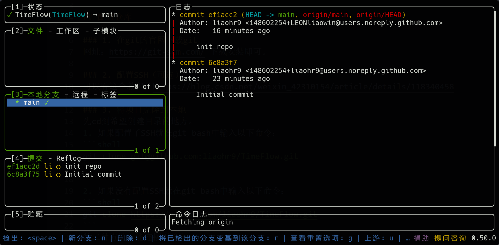

# Git团队工作流

## 一、使用工具：lazygit

https://github.com/jesseduffield/lazygit



1. 下载scoop

```powershell
Set-ExecutionPolicy -ExecutionPolicy RemoteSigned -Scope CurrentUser
iwr -useb get.scoop.sh | iex
```

2. 下载lazygit

```powershell
scoop bucket add extras
scoop install lazygit
```

## 二、项目分支划分

- main：正式发布版本
- dev：开发版本
- feature/module：功能/模块版本

---

工作开发时以解决某个issue或feature为导向进行开发推进

## 三、项目开发流程

团队分为两种权限：

- admin：管理员权限，负责审查pull request
- write：只能克隆，拉取，推送，发送pull request

---

1. 创建并切换到当前分支
   - 按n新建，光标移动到该分支按space切换
2. 编程
3. 添加文件并提交
   - 按a添加所有文件，光标移动到该文件按space可以添加单一文件
   - 按c进行提交（注意commit message规范）
4. 推送并提交pull request（申请合并到主分支）
   - 按p进行拉取，按P进行推送，按o进行pull request

## 四、多人协作同一分支

在本地创建同名分支，再进行拉取，关联到远程分支

ps：按？进行查询lazygit按键映射